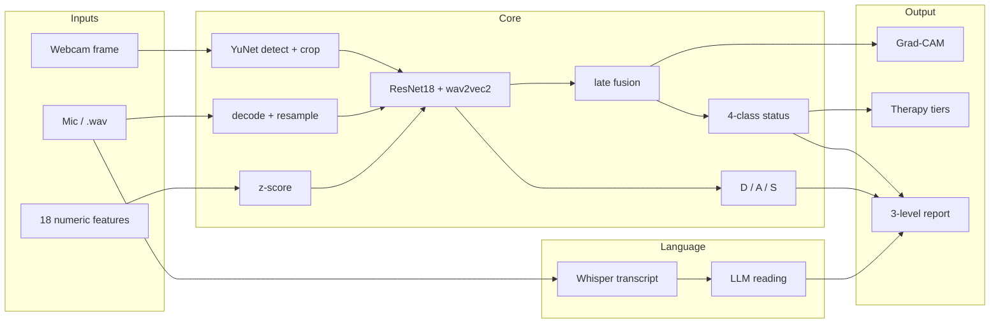

# MindScan AI

**Explainable multimodal mental-health screening — and somewhere to act on the result.**
Built for Hack2Health.

MindScan reads three independent signals — facial expression, vocal tone, and self-reported wellbeing — transcribes what you actually said about your day, explains its reasoning in plain language, then gives you somewhere to go next: guided relaxation, a companion to talk to, curated reading, and every major helpline in India.

> **Decision support, not a diagnosis.** Not a medical device.

---

## 1. The problem

One in seven Indians lives with a mental-health condition, and the treatment gap sits around **70–90%**. The blockers are well known: too few clinicians, cost, stigma, and the simple difficulty of knowing whether what you're feeling warrants help at all.

Most digital screening tools are a questionnaire with a score at the end. That fails in three ways:

| Failure | Why it matters |
|---|---|
| **Self-report is easy to game** | People answer how they think they should, especially about stigmatised feelings |
| **A score isn't actionable** | "You scored 22/39" tells someone nothing about what to *do* |
| **A black box isn't trustworthy** | If a tool can't say *why*, a clinician can't use it and a user won't believe it |

---

## 2. Our approach

**Read three signals at once, then explain and act.**

Any single channel is easy to fool — people mask their face, flatten their voice, or answer a form the way they think they should. Reading three makes **disagreement visible**, and disagreement is itself informative. When someone's words say "fine" but their face and voice don't, MindScan reports the conflict rather than averaging it away.

```
     WHAT WE MEASURE                WHAT WE DO WITH IT
     ─────────────────              ──────────────────
     Face   →  expression  ┐
     Voice  →  tone        ├──→  fused score  →  explained  →  acted on
     Words  →  content     │      + status       (3 levels)     (5 ways)
     Form   →  18 signals  ┘
```

---

## 3. What we built

### Screening
| Capability | Implementation |
|---|---|
| **Facial affect** | ResNet18 fine-tuned on FER-2013, with YuNet face detection so the model sees a face, not a room |
| **Vocal tone** | wav2vec2-base fine-tuned on RAVDESS, evaluated speaker-disjoint |
| **Spoken content** | Groq Whisper transcription, then an LLM reading of *what was said* — separate from *how it sounded* |
| **Self-report** | 18 behavioural / physiological features, z-scored against a 4,000-row reference set |

### Explanation — three levels
| Level | Output |
|---|---|
| Plain English | "Low mood looks like a strong theme right now." |
| Visual | Real Grad-CAM saliency on the trained CNN, feature-contribution chart |
| Clinical | Feature-by-feature table with z-scores and direction |

### Acting on it
| Feature | What it does |
|---|---|
| **Therapy signposting** | Stepped-care tiers matched to severity, with Indian directories |
| **Relax Hub** | Generative soundscapes + a computer-vision movement coach |
| **AI Companion** | A listening space, with deterministic crisis detection |
| **Reading library** | 16 curated pieces from WHO / NIMH / Mind / NHS, personalised to your result |
| **Help directory** | 16 helplines across India, searchable by city and language |

---

## 4. Measured performance

Every figure is from a held-out set and reproducible via `training/`.

| Model | Task | Result | Baseline | Notes |
|---|---|---|---|---|
| Facial encoder | 7-class FER | **70.3%** | 25.1% majority | Near the practical ceiling for FER-2013 |
| Speech encoder | 4-class status | **67.1%** | 40.7% majority | **Speaker-disjoint** — test voices never seen in training |

Speaker-disjoint evaluation matters: the four test actors never appear in training, so the number reflects generalisation to a **new voice**, not memorisation of familiar ones. Most published RAVDESS numbers are not evaluated this way.

### Bugs we found and fixed

Each was caught by testing rather than assumed away. This is the section worth talking through in a demo — it shows the difference between "it runs" and "it works."

| Bug | Impact | Fix |
|---|---|---|
| Webcam frame squashed 640×480 → 48×48 | A **smiling** face classified as **fear, 53.9%** — the model was reading a distorted room | YuNet face detection + tight crop → happy now **99%** |
| Audio parsed as headerless 16 kHz PCM | RAVDESS is 48 kHz with a RIFF header, so the model got 3×-speed garbage → **25.4%** | Proper decode + resample → **65.8%** |
| Classifier heads never called at inference | Only embeddings used; their *mean* was added to depression, so the score moved the same whether you smiled or scowled | Real classifiers now produce a **directional** distress signal |
| 4 sliders defaulted outside the data range | `Head_Motion_Index` 4.2 on a 0–1 feature → z = **+12.7**, pinning stress at its cap on *every* submission | Ranges and defaults matched to the real distribution |
| Naive UTC timestamps | Browser parsed them as local → every session displayed **5h30m early** | Explicit UTC offset, rendered in IST |
| Crisis regex too broad | *"this deadline is killing me"* triggered a helpline card | Tightened — false alarms train people to dismiss the one that matters |

### Honesty about the tabular data

The supplied 4,000-row CSV was tested for a learnable relationship between its 18 features and its labels, two independent ways:

- Pearson correlation: **all |r| < 0.05**
- 300-tree random forest: **39.3%** accuracy against a **40.7%** majority-class baseline, with perfectly uniform feature importances (~1/16 each — the signature of noise)

Both say the same thing: **the labels are not a function of the features.** Rather than ship a model that fits noise and quote a meaningless accuracy, `training/generate_synthetic_labels.py` regenerates labels from a designed, documented relationship so the pipeline can be demonstrated end-to-end — and the script, the code and this README all state plainly that those labels are synthetic.

**The face and voice models are trained on real data throughout.**

---

## 5. Technical highlights

Things that are harder than they look, and worth pointing at:

**Real Grad-CAM, not a decorative overlay.** Hooks the last conv block of the fine-tuned ResNet18, backpropagates the predicted class, and weights activation maps by pooled gradients. Verified input-dependent: different faces produce different heatmaps and different focus regions.

**Deterministic crisis detection.** The companion's risk check is a regex over the user's own words, *not* delegated to the LLM — so it cannot be jailbroken, talked around, or missed by a model having an off moment. Verified across 14 cases: `"I want to die"` triggers support; `"this deadline is killing me"` correctly does not.

**Severity encoded as luminance, not hue.** The UI is greyscale to match the hero. Colour-coded risk would vanish in that palette, so severity maps to *brightness* — a Severe result is the brightest element on screen. Charts add dash patterns alongside luminance, which also keeps them readable for colour-blind users and in greyscale print.

**Generative audio, not shipped MP3s.** Six soundscapes synthesised live with the Web Audio API — detuned oscillator pads, spectrum-tilted noise, a sparse pentatonic voice (so random notes can never land dissonant), under a filter swell on an ~11-second cycle matched to a relaxed breath. No licensing question, no download, and **no two minutes ever repeat**.

**Scale-invariant pose scoring.** Every joint measurement in the movement coach is normalised by shoulder width, so it behaves identically whether you sit close to the camera or far back. Rep counting uses hysteresis — a rep lands only after crossing high *and* returning below low — so holding a stretch can't generate phantom reps from tracking jitter.

**Everything degrades rather than fails.** No Groq key, no network, no WebGL, no camera, no microphone: each produces a labelled "unavailable" state with a reason. The assessment still completes. If Groq is unreachable *during a crisis disclosure*, the companion still returns a caring message plus helplines — the one failure mode that must never be a stack trace.

---

## 6. Architecture

```
                    ┌─────────────────────────────────────────┐
                    │              React + Vite UI            │
                    │  Landing · Assessment · Results         │
                    │  Live · Trends · Relax · Talk           │
                    │  Reading · Help · About                 │
                    └───────────────┬─────────────┬───────────┘
                                    │ HTTP        │ WebSocket
                                    ▼             ▼
                    ┌─────────────────────────────────────────┐
                    │           FastAPI  (backend/)           │
                    │  /assessment /history /realtime         │
                    │  /companion  /report  /explain /wellness│
                    └───────────────┬─────────────────────────┘
                                    │
         ┌──────────────────────────┼──────────────────────────┐
         ▼                          ▼                          ▼
   YuNet detect → 48×48       Decode → 16 kHz mono        18 tabular cols
   ResNet18 encoder           wav2vec2 encoder            z-scored vector
         │                          │                          │
         │                    Whisper → transcript             │
         │                          │                          │
         └──────────────┬───────────┴──────────┬───────────────┘
                        ▼                      ▼
                 Late fusion +            D / A / S
                 quality weights          scores
                        │                      │
                        └──────────┬───────────┘
                                   ▼
                    Mental_Health_Status
                    Healthy | Mild | Moderate | Severe
                                   │
      ┌──────────┬─────────┬───────┼───────┬──────────┬─────────┐
      ▼          ▼         ▼       ▼       ▼          ▼         ▼
   Grad-CAM  LLM report  Wellness Therapy Crisis   Companion  Reading
   + SHAP    + motivation engine  tiers   helplines  chat     library
                    SQLite / Postgres session store
```

### Per-assessment pipeline



### Stack

| Layer | Technology |
|---|---|
| Frontend | React, Vite, TailwindCSS, Framer Motion, Redux Toolkit, Recharts, three.js |
| Backend | FastAPI (Python 3.11+) |
| Inference | PyTorch — ResNet18 (facial), wav2vec2-base (speech) |
| Face detection | OpenCV **YuNet** DNN, vendored offline |
| Speech-to-text | Groq **Whisper** (`whisper-large-v3-turbo`) |
| Language / companion | Groq **Llama 3.3 70B**, JSON mode with model fallback |
| Pose tracking | **MediaPipe Pose Landmarker**, vendored offline |
| Ambient audio | Web Audio API — synthesised, zero files |
| Database | SQLite locally, PostgreSQL via Docker |
| PDF | WeasyPrint (server) + jsPDF (client) |

---

## 7. Feature detail

### Relax Hub — `/relax`

**Sound room.** Six generative soundscapes: *Rain on glass · Dusk tape · Deep work · Drift · Slow morning · Grounding hum*.

**Movement coach.** MediaPipe tracks 33 landmarks and scores five guided stretches with automatic rep counting:

| Exercise | Targets |
|---|---|
| Neck release | Where tension headaches and jaw clenching start |
| Shoulder rolls | Shoulders that creep up under stress and stay there |
| Chest opener | Counteracts a hunched screen posture |
| Overhead reach | Opens the ribcage so a full breath is easier |
| Paced breathing | 4 in / 4 hold / 6 out — the long exhale is what settles the nervous system |

Model and WASM runtime are vendored, so it runs **fully offline** and the camera feed never leaves the device.

### AI Companion — `/companion`

A conversational space, grounded in the user's latest screening. Reflects first, asks one open question at a time, keeps replies short, and is explicitly forbidden from diagnosing, naming conditions, or giving medication advice.

Crisis detection is **deterministic** (see §5).

### Reading library — `/library`

16 pieces from WHO, NIMH, Mind, NHS, Mental Health Foundation, APA, Sleep Foundation, iCall and NIMHANS. Filterable by topic, and **re-ordered to surface whatever matches your latest screening first**.

Deliberately **links rather than reproduces** — that guidance belongs to its publishers, who keep it current. Every URL was checked and returned HTTP 200 before inclusion.

### Help directory — `/help`

16 helplines grouped **national 24×7 → regional → specialised**, so nobody in distress has to scan a directory for one that's open. Every number is a tappable `tel:` link with hours and languages. Emergency numbers sit above everything.

> ⚠️ **Verify before deployment.** These are well-established public numbers, but helplines change. A crisis line that rings out is worse than none.

### Therapy signposting

| Tier | When | Offers |
|---|---|---|
| `maintain` | Healthy | Guided self-help only, no directories |
| `self_help_plus` | Mild | Self-directed steps, check in if it persists |
| `guided_support` | Moderate | Counselling or a structured programme |
| `professional_soon` | Severe / crisis | Talking therapy + clinical assessment + helplines |

Options are score-targeted: anxiety skills when anxiety is raised, behavioural activation when depression is, sleep work when stress is. **It signposts, it does not prescribe** — each option says what it involves and why it surfaced, never "you need this."

---

## 8. Running it

```bash
cp .env.example .env          # then set USE_MOCK_INFERENCE=false
pip install -r requirements.txt -r requirements-ml.txt
PYTHONPATH=. python -m uvicorn backend.app:app --port 8000

cd frontend && npm install && npm run dev
```

Open <http://localhost:5173>. Verify with `curl localhost:8000/api/health` — it must report `"using_mock": false` and six loaded models.

### Trained weights are included

The `.pt` files are committed, so a fresh clone runs the **real models** — no training
step, no downloads. Confirm with:

```bash
curl localhost:8000/api/health
# {"ok":true,"models_ready":true,"using_mock":false,
#  "loaded":["facial_encoder","speech_encoder","classifier","depression","anxiety","stress"]}
```

If it reports `"using_mock": true`, the ML extras are missing — run
`pip install -r requirements-ml.txt`. The loader falls back to a mock pipeline rather than
crashing when PyTorch is unavailable.

`speech_encoder.pt` stores only the fine-tuned layers (54 MB, not 360 MB); the frozen
wav2vec2-base weights are fetched from HuggingFace on first construction and cached, so the
**first run needs internet**. Predictions are bit-identical to the full checkpoint —
verified at a maximum logit difference of `0.000e+00` by
`training/slim_speech_checkpoint.py`.

To retrain from scratch instead, the full dataset and all scripts are committed:

```bash
python training/train_facial.py              # ~18 min on a GPU
python training/train_speech.py              # ~5 min
python training/generate_synthetic_labels.py
python training/train_fusion.py              # seconds
```

### Optional: Groq

Transcription, the AI report and the companion need Groq keys in `.env` (`ENABLE_GROQ=true`). Without them the assessment runs normally and those panels report themselves unavailable.

---

## 9. API

| Method | Path | Purpose |
|---|---|---|
| GET | `/api/health` | Model load status — check `using_mock` here |
| POST | `/api/assessment/run` | Full multimodal assessment |
| POST | `/api/realtime/analyze-face` | Single-frame emotion |
| POST | `/api/companion/chat` | One companion turn |
| GET | `/api/explain/{id}` | Stored XAI payload |
| GET | `/api/history/sessions` | Sessions + trend arrows |
| GET | `/api/report/{id}/pdf` | Clinical PDF (HTML fallback) |
| WS | `/api/realtime/ws` | Live emotion smoothing |

Timestamps are emitted as UTC with an explicit offset and rendered in IST.

---

## 10. Design language

Monochrome, sampled from the hero clip (`frontend/public/assets/landing-bg.mp4`) — a grey ring hovering in near-black, lit from above. The frame measures **~2.7/255 mean saturation**, so any hue would read as contamination.

| Token | Hex | Use |
|---|---|---|
| `ink-950` | `#060606` | Page ground |
| `ink-500` | `#454545` | Ring body, mid surfaces |
| `ink-300` | `#9e9e9e` | Secondary text |
| `ink-100` | `#e6e6e6` | Body copy |
| `ink-50` | `#f4f4f5` | Lit edge, primary actions, Severe status |

Fonts: Inter (UI), DM Serif Display (display). Buttons are **water-drop** shaped — asymmetric silhouette, specular highlight, refracted lower rim, slight squash on press. Every score carries a range (`18/39 — Mild`), never a bare number.

**One deliberate exception:** crisis helpline numbers are dark, bold and oversized on a white card. Legibility beats aesthetic consistency for the one number someone in crisis has to read.

---

## 11. Repository layout

```
backend/
  api/routes/        assessment · history · realtime · companion · report · wellness
  core/
    preprocessors/   face detect+crop · audio decode+resample · z-scoring
    inference/       scoring and status engines
    explainability/  Grad-CAM · attribution · report builder
    llm/             Groq transcription · narrative · companion
  features/          crisis · therapy signposting · trends · wellness
  models/            architectures + vendored YuNet detector
frontend/src/
  components/relax/     ambient engine · pose coach · exercises
  components/results/   plain summary · insights · AI report · therapy
  components/articles/  curated reading library
  components/help/      helpline directory
training/            four reproducible scripts
```

---

## 12. Limitations

Stated plainly, because a screening tool that oversells itself is worse than none:

- **Not a diagnosis**, and not validated against clinical outcomes.
- FER-2013 is noisy and imbalanced; 70.3% is near its practical ceiling.
- The speech model saw 24 speakers — mostly North American, **acted** rather than spontaneous emotion. Real-world accuracy will be lower.
- Tabular labels are synthetic (§4). Face and voice models are not.
- The final score combination is a **hand-designed formula, not learned**, because no dataset pairs real faces and voices with real clinical labels.
- The LLM narrative is generative and can be wrong; it is labelled as such in the UI.
- Helpline numbers need verification before real deployment.

---

## 13. Where this goes next

- Clinical validation against PHQ-9 / GAD-7 with a real cohort
- Train fusion end-to-end once genuinely paired multimodal data exists
- Indian-language speech models — RAVDESS is English and acted
- On-device inference so no audio or video leaves the phone
- Longitudinal modelling: detect a downward trend before it becomes a crisis
