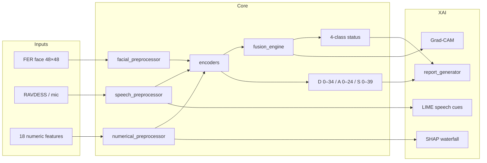

# MindScan AI

Explainable multimodal AI for psychiatric **screening** (Hack2Health). Face, speech, and 18 tabular signals are fused into a 4-class mental-health status plus continuous depression / anxiety / stress scores, with layered explanations.

This software is **decision support**, not a diagnosis and not a medical device.

Repo: [https://github.com/Aayannoori15/MindScanAI](https://github.com/Aayannoori15/MindScanAI)

---

## Architecture

```
                    ┌─────────────────────────────────────────┐
                    │              React + Vite UI            │
                    │  Landing · Assessment · Results         │
                    │  Live emotion · Trends · PDF            │
                    └───────────────┬─────────────┬───────────┘
                                    │ HTTP        │ WebSocket
                                    ▼             ▼
                    ┌─────────────────────────────────────────┐
                    │           FastAPI  (backend/)           │
                    │  /api/assessment  /explain  /history    │
                    │  /api/report      /wellness /realtime   │
                    └───────────────┬─────────────────────────┘
                                    │
         ┌──────────────────────────┼──────────────────────────┐
         ▼                          ▼                          ▼
   Facial 48×48 FER          RAVDESS speech              18 tabular cols
   grayscale tensor          log-mel + MFCC/pitch        z-scored vector
         │                          │                          │
         └──────────────┬───────────┴──────────┬───────────────┘
                        ▼                      ▼
                 Late fusion +            D / A / S
                 quality weights          regressors
                        │                      │
                        └──────────┬───────────┘
                                   ▼
                    Mental_Health_Status
                    Healthy | Mild_Stress | Moderate_Stress | Severe_Stress
                                   │
              ┌────────────────────┼────────────────────┐
              ▼                    ▼                    ▼
           XAI (3 levels)     Wellness engine     Crisis + helplines
           SQLite / Postgres session store
```

### Pipeline (per assessment)



### Stack

| Layer | Technology |
|---|---|
| Frontend | React, Vite, TailwindCSS, Framer Motion, Redux Toolkit, Recharts |
| Real-time | WebSocket (`/api/realtime/ws`) |
| Backend | FastAPI (Python 3.11+) |
| Inference | PyTorch weights in `backend/models/` (mock pipeline until they land) |
| XAI | Grad-CAM, SHAP, LIME (proxies until `requirements-ml.txt` is installed) |
| Face (client) | Webcam capture; MediaPipe / face-api.js still to wire |
| Audio | Mic + optional RAVDESS `.wav`; librosa when ML extras are installed |
| Database | SQLite locally, PostgreSQL via Docker |
| PDF | WeasyPrint (server) + jsPDF (client) |
| Deploy | Docker Compose |

Dataset contracts (FER, RAVDESS, 18 columns, score ranges) live in [`docs/dataset.md`](docs/dataset.md) and [`backend/core/dataset_spec.py`](backend/core/dataset_spec.py). Model drop path: [`docs/model_placement.md`](docs/model_placement.md).

---

## Quick start

```bash
git clone https://github.com/Aayannoori15/MindScanAI.git
cd MindScanAI
cp .env.example .env

python3 -m venv .venv
source .venv/bin/activate          # Windows: .venv\Scripts\activate
pip install -r requirements.txt
PYTHONPATH=. uvicorn backend.app:app --reload --port 8000

cd frontend && npm install && npm run dev
```

Open [http://localhost:5173](http://localhost:5173)

Optional trained-model / DSP / PDF extras: `pip install -r requirements-ml.txt`

The API uses a **documented mock pipeline** until `.pt` files exist. After dropping weights into `backend/models/`, set `USE_MOCK_INFERENCE=false`.

### Dependency files

| File | What it is |
|---|---|
| `requirements.txt` | Python API (from repo root) |
| `backend/requirements.txt` | Same list, canonical |
| `backend/requirements-lock.txt` | Fully pinned pip freeze |
| `requirements-ml.txt` | Optional PyTorch, librosa, SHAP, Grad-CAM, WeasyPrint |
| `frontend/package.json` + `package-lock.json` | React / Vite |

---

## Additional features (teammate backlog)

Scaffolding exists for most of these. Use this list as the contribution map — pick a feature, replace the mock, keep the API contract.

### 1. Real-time continuous emotion tracking

During assessment, webcam + mic should stream affect continuously (not a single snapshot) and build an **emotion timeline**.

- **Intended:** on-device MediaPipe or face-api.js; probabilities streamed to the UI and stored on the session.
- **Now:** `LiveFaceAnalysis`, `EmotionMeter`, `SpeechWaveform`, `/api/realtime/ws`, and a client-side proxy distribution.
- **Work:** swap the proxy for a lightweight on-device model; persist the timeline with the assessment payload (`emotion_timeline`).

### 2. Multi-session trend dashboard

Personal D / A / S scores across visits, with interactive line charts and **improving / stable / worsening** arrows.

- **Intended:** longitudinal tracker, not a one-shot tool.
- **Now:** `Dashboard`, `TrendChart`, `SessionHistory`, `GET /api/history/sessions`, `trend_analyzer.py`.
- **Work:** bind sessions to authenticated users; polish empty states and date ranges.

### 3. Modality confidence scoring

Report per-stream confidence, e.g. “Facial 78%, Speech 65%, Physiological 90%”. Blurry frames or noisy audio should **down-weight** that modality.

- **Intended:** clinician-grade uncertainty quantification.
- **Now:** quality flags in preprocessors + `fusion_engine` reweighting + radar chart on Results.
- **Work:** calibrate confidence from encoder entropy / reconstruction error once real weights land.

### 4. One-click clinical PDF report

Download a formatted report: scores, Grad-CAM, modality contribution, wellness tips, and a **not a diagnosis** disclaimer.

- **Now:** `GET /api/report/{id}/pdf` (WeasyPrint when installed, HTML fallback) and client jsPDF.
- **Work:** embed heatmap + radar in the PDF; tighten clinical layout.

### 5. Crisis detection and safe messaging

If status is `Severe_Stress` or stress ≥ 30 / 39, show a **warm, non-alarmist** modal with Indian helplines (iCall, Vandrevala, KIRAN / NIMHANS).

- **Now:** `crisis_detector.py` + `CrisisAlert` modal.
- **Work:** copy review against safe-messaging guidelines; optional clinician notify flag (no alarming reds).

### 6. Wellness engine with personalized suggestions

Micro-interventions from the **dominant stress drivers** (sleep, isolation, digital load, GSR/blink), not generic advice.

- **Now:** `wellness_engine.py` keyed off the 18 dataset columns.
- **Work:** richer tip bank, optional timed breathing UI, language (EN / HI / TA).

### 7. Explainability layer — three levels

| Level | What teammates should ship |
|---|---|
| 1 Plain English | “Facial affect showed reduced engagement. Speech had elevated tension markers.” |
| 2 Visual | Grad-CAM on the FER face + SHAP waterfall for the 18 features |
| 3 Clinical | Feature-by-feature contribution table |

- **Now:** `report_generator.py` plus Grad-CAM / SHAP / LIME **proxies**.
- **Work:** hook `pytorch-grad-cam`, SHAP, and LIME to the real encoders (`pip install -r requirements-ml.txt`).

### 8. Language-aware stress cues (bonus)

Detect stress in **Tamil / Hindi / English** from prosody (pitch, rate, MFCC) without ASR.

- **Now:** language hint on the assessment form; RAVDESS-style speech features.
- **Work:** train / drop a language-agnostic prosody encoder as `speech_encoder.pt`.

---

## Suggested teammate split

| Area | Path | Notes |
|---|---|---|
| Trained weights | `backend/models/` | See `docs/model_placement.md` |
| Facial model | `notebooks/02_facial_model.ipynb` | FER 7-class → stress map in `dataset_spec.py` |
| Speech model | `notebooks/03_speech_model.ipynb` | RAVDESS 8-class + prosody |
| Fusion + D/A/S | `notebooks/04_fusion_model.ipynb` | Late fusion / attention |
| XAI eval | `notebooks/05_xai_evaluation.ipynb` | Replace proxies |
| On-device live face | `frontend/src/components/realtime/` | MediaPipe / face-api.js |

---

## API

| Method | Path | Purpose |
|---|---|---|
| GET | `/api/health` | Model load status |
| POST | `/api/assessment/run` | Multipart assessment |
| GET | `/api/explain/{id}` | Stored XAI payload |
| GET | `/api/history/sessions` | Longitudinal sessions |
| GET | `/api/report/{id}/pdf` | Clinical PDF |
| WS | `/api/realtime/ws` | Live emotion smoothing |

Full reference: [`docs/api_reference.md`](docs/api_reference.md)

---

## Design language

| Token | Hex | Use |
|---|---|---|
| Navy | `#0F1B2D` | Primary |
| Teal | `#00BFA6` | Accent |
| Amber | `#F59E0B` | Warning / moderate |
| Rose | `#FB7185` | Severe (not harsh red) |
| Mist | `#F8FAFC` | Background |

Fonts: Inter (UI), DM Serif Display (hero). Every score includes a range (e.g. `18/39 — Mild`), not a bare number.
